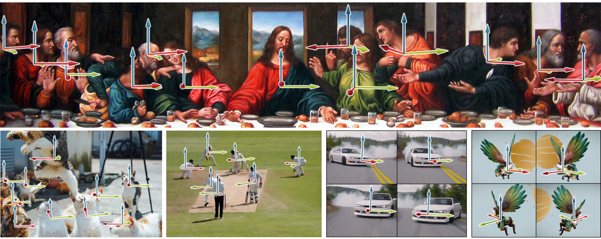

# 3D Object Orientation Estimation using DINOv2

End-to-end system for estimating 3D object orientation (azimuth, polar angle, rotation) from a single RGB image using DINOv2 with a custom CPU-based 3D rendering engine.

---

## Overview

This project performs monocular 3D orientation estimation by:

- Extracting visual features using **DINOv2 (Large)**
- Passing features through a custom MLP head
- Predicting:
  - Azimuth (0°–360°)
  - Polar angle (-90°–90°)
  - Rotation (-90°–90°)
  - Confidence score
- Rendering predicted orientation using a custom-built 3D renderer
- Deploying via Hugging Face Spaces using Gradio

---

## Architecture

Input Image  
↓  
DINOv2 Backbone  
↓  
MLP Projection Head  
↓  
Angle Prediction (3 angles + confidence)  
↓  
Custom 3D Axis Renderer  

---

## Example Output



---

## Tech Stack

- Python
- PyTorch
- Transformers (HuggingFace)
- DINOv2
- NumPy
- PIL
- Gradio
- Custom CPU-based 3D rendering pipeline

---

## Live Demo

Hugging Face Deployment:  
[(https://huggingface.co/spaces/TerryTogyThomas/3d-object-orientation-estimation-docker)]

---

## Installation

```bash
pip install -r requirements.txt
